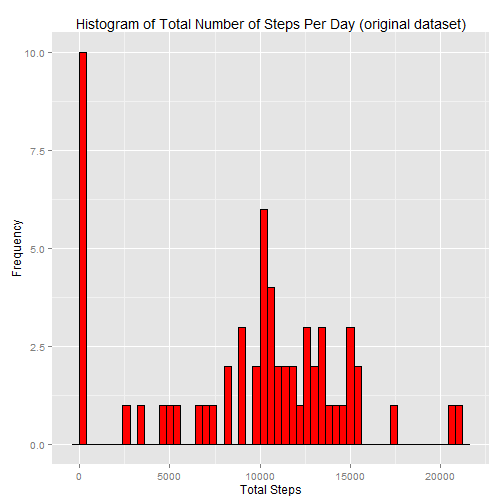
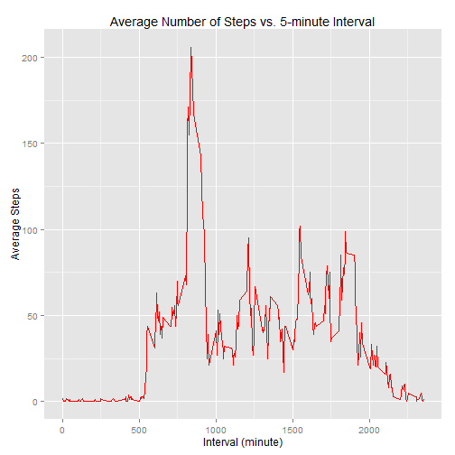
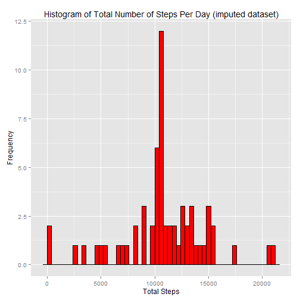
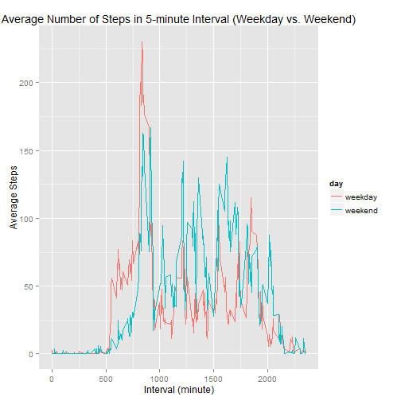

Peer Assessment 1 in Reproducible Research 
=============================================

#### June 13, 2015

### Introduction  

It is now possible to collect a large amount of data about personal movement using activity monitoring devices such as a Fitbit, Nike Fuelband, or Jawbone Up. These type of devices are part of the "quantified self" movement - a group of enthusiasts who take measurements about themselves regularly to improve their health, to find patterns in their behavior, or because they are tech geeks. But these data remain under-utilized both because the raw data are hard to obtain and there is a lack of statistical methods and software for processing and interpreting the data.  

This assignment makes use of data from a personal activity monitoring device. This device collects data at 5 minute intervals through out the day. The data consists of two months of data from an anonymous individual collected during the months of October and November, 2012 and include the number of steps taken in 5 minute intervals each day.  
        
### Data  

The data for this assignment can be downloaded from the course web site:

- Dataset: [Activity monitoring data](https://d396qusza40orc.cloudfront.net/repdata%2Fdata%2Factivity.zip) [52K]

The variables included in this dataset are:

- steps: Number of steps taking in a 5-minute interval (missing values are coded as NA)

- date: The date on which the measurement was taken in YYYY-MM-DD format

- interval: Identifier for the 5-minute interval in which measurement was taken

The dataset is stored in a comma-separated-value (CSV) file and there are a total of 17,568 observations in this dataset.

### Loading and preprocessing the data
- Load the data


```r
# get the system and date information

version
```

```
##                _                           
## platform       x86_64-w64-mingw32          
## arch           x86_64                      
## os             mingw32                     
## system         x86_64, mingw32             
## status                                     
## major          3                           
## minor          1.3                         
## year           2015                        
## month          03                          
## day            09                          
## svn rev        67962                       
## language       R                           
## version.string R version 3.1.3 (2015-03-09)
## nickname       Smooth Sidewalk
```

```r
Sys.time()
```

```
## [1] "2015-06-13 17:39:48 CDT"
```

```r
# download the data

setwd("C:/Users/WChan/Desktop/CWK/Reproducible Research")
setInternet2(use = TRUE)
url <- "https://d396qusza40orc.cloudfront.net/repdata%2Fdata%2Factivity.zip"
download.file(url, destfile = "C:/Users/WChan/Desktop/CWK/Reproducible Research/activity.zip")
unzip("activity.zip", "activity.csv")
unlink("activity.zip")

# load the data

activity <- read.csv("activity.csv")
```

- Process/transform the data (if necessary) into a format suitable for analysis  


```r
# transform the variable date into the Date format

library(lubridate) 
activity$date <- ymd(activity$date)
```

### What is mean total number of steps taken per day?  

- Calculate the daily total number of steps

```r
library(dplyr)
```

```
## 
## Attaching package: 'dplyr'
## 
## The following objects are masked from 'package:lubridate':
## 
##     intersect, setdiff, union
## 
## The following object is masked from 'package:stats':
## 
##     filter
## 
## The following objects are masked from 'package:base':
## 
##     intersect, setdiff, setequal, union
```

```r
library(ggplot2)

# group the data according to the date

group_date <- group_by(activity, date)

# calculate the total steps in each day

total_steps_daily <- summarize(group_date, tsd= sum(steps, na.rm = TRUE)) 


# plot the histogram

ggplot(total_steps_daily, aes(tsd)) + geom_histogram(color = "black", fill = "red", binwidth = 400) + xlab("Total Steps") + ylab("Frequency") + ggtitle("Histogram of Total Number of Steps Per Day (original dataset)")
```

 

- Calculate and report the mean and median of the total number of steps taken per day

```r
tsd_mean <- round(mean(total_steps_daily$tsd),0)
tsd_median <- median(total_steps_daily$tsd)
```
The mean and median of the total number of steps taken per day are 9354 and 10395, respectively.  

### What is the average daily activity pattern?  

- Make a time series plot (i.e. type = "l") of the 5-minute interval (x-axis) and the average number of steps taken, averaged across all days (y-axis)

```r
# group the data according to the interval

group_interval <- group_by(activity, interval)

# calculate the averaged steps in each interval

average_steps_interval <- summarize(group_interval, asi = round(mean(steps, na.rm = TRUE),0))

# plot the data

ggplot(average_steps_interval, aes(x=interval, y=asi)) + geom_line(color = "red", type = "l") + xlab("Interval (minute)") + ylab("Average Steps") + ggtitle("Average Number of Steps vs. 5-minute Interval")
```

 

- Which 5-minute interval, on average across all the days in the dataset, contains the maximum number of steps?  

```r
interval_max_steps <- average_steps_interval[which.max(average_steps_interval$asi),]$interval
```
The interval 835 minute contains the maximun average number of steps across all the days.

### Imputing missing values.

- Calculate and report the total number of missing values in the dataset (i.e. the total number of rows with NAs)

```r
summary(activity)
```

```
##      steps             date               interval     
##  Min.   :  0.00   Min.   :2012-10-01   Min.   :   0.0  
##  1st Qu.:  0.00   1st Qu.:2012-10-16   1st Qu.: 588.8  
##  Median :  0.00   Median :2012-10-31   Median :1177.5  
##  Mean   : 37.38   Mean   :2012-10-31   Mean   :1177.5  
##  3rd Qu.: 12.00   3rd Qu.:2012-11-15   3rd Qu.:1766.2  
##  Max.   :806.00   Max.   :2012-11-30   Max.   :2355.0  
##  NA's   :2304
```

- Devise a strategy for filling in all of the missing values in the dataset.  

Stratety: the mean of steps taken for the 5-minute interval across all days was used to fill in the missing values specific for that particular 5-minute interval. They were already calculted and stored in the data frame "average_steps_interval". The new dateset "activity_imputed" was created with the missing data filled in.


```r
# create a new data frame containing the origianl data

activity_imputed <- activity

# use the loop function to get the row containing the missing values and use the average of the steps in that particular interval to replace the missing value in that row.

for (i in 1:nrow(activity_imputed)) {
        if (is.na(activity_imputed[i,]$steps)){
                interval_index <- activity_imputed[i,]$interval
                activity_imputed[i, ]$steps <- average_steps_interval[average_steps_interval$interval == interval_index, ]$asi
                }
}
```

- Make a histogram of the total number of steps taken each day and Calculate and report the mean and median total number of steps taken per day. Do these values differ from the estimates from the first part of the assignment? What is the impact of imputing missing data on the estimates of the total daily number of steps?

```r
# group the new dataset according the date

group_date <- group_by(activity_imputed, date)

# calculate the daily total steps 

total_steps_daily_imputed <- summarize(group_date, tsd= sum(steps)) 


# plot the data

ggplot(total_steps_daily_imputed, aes(tsd)) + geom_histogram(color = "black", fill = "red", binwidth = 400) + xlab("Total Steps") + ylab("Frequency") + ggtitle("Histogram of Total Number of Steps Per Day (imputed dataset)")
```

 

```r
# compute the mean and median

tsd_mean_imputed <- round(mean(total_steps_daily_imputed$tsd),0)
tsd_median_imputed <- median(total_steps_daily_imputed$tsd)
```
The mean and median of the total number of steps taken per day in the new dataset are 1.0766 &times; 10<sup>4</sup> and 1.0762 &times; 10<sup>4</sup>, respectively. The imputed missing data impacted dramatically the low end distribution of the data of the total number of steps per day in the histogram and the mean value but only slightly on the median value.

### Are there differences in activity patterns between weekdays and weekends?

- Create a new factor variable in the dataset with two levels - "weekday" and "weekend" indicating whether a given date is a weekday or weekend day.

```r
activity_imputed$day <- as.factor(ifelse( weekdays(activity_imputed$date) %in% c("Saturday", "Sunday"), "weekend", "weekday"))
```
- Make a panel plot containing a time series plot (i.e. type = "l") of the 5-minute interval (x-axis) and the average number of steps taken, averaged across all weekday days or weekend days (y-axis).  

```r
# group the data by day then by interval

group_interval_day <- group_by(activity_imputed, day, interval)

# calculate the average steps in each interval

average_steps_interval_day <- summarize(group_interval_day, asi = mean(steps))

# plot the data and specify the group variable "day"

ggplot(average_steps_interval_day, aes(x=interval, y=asi, color = day)) + geom_line(type = "l") + xlab("Interval (minute)") + ylab("Average Steps") + ggtitle("Average Number of Steps in 5-minute Interval (Weekday vs. Weekend)")
```

 


